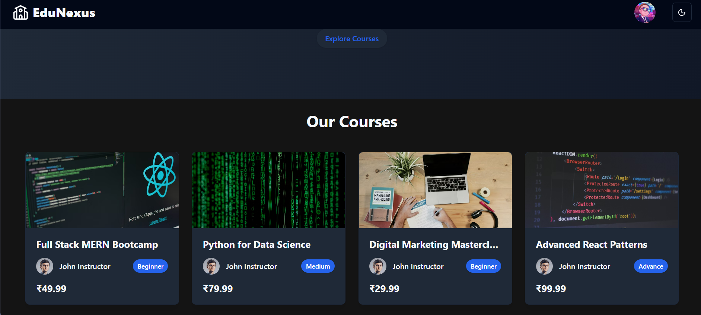
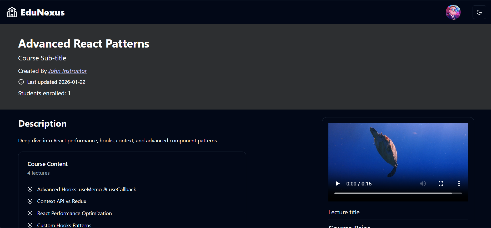
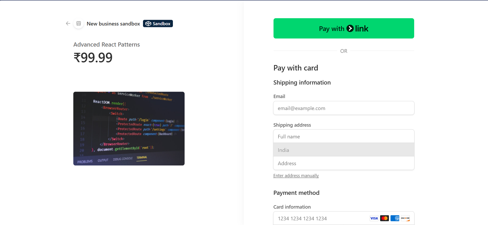

# EduNexus - Learning Management System

EduNexus is a full-stack Learning Management System (LMS) designed to provide a seamless e-learning experience. It features a robust monolithic architecture with a React frontend and Node.js/Express backend, offering functionalities for students to enroll in courses, watch video lectures, and track their progress, while instructors can create and manage course content.

---

## 📸 Screenshots

### Login & Authentication

Secure user authentication with Login and Signup functionality.


### Course Dashboard

Browse a variety of courses with filtering and search capabilities.


### Course Details & Learning

Interactive video player with lecture lists and progress tracking.


### Payments

Secure payment integration via Stripe.


---

## 🚀 Features

- **User Authentication**: Secure Login/Signup with JWT and Cookies.
- **Role-Based Access**: Separate dashboards for Students and Instructors.
- **Course Management**: Instructors can create, edit, and publish courses with video lectures.
- **Course Consumption**: Students can purchase courses, watch lectures, and track progress.
- **Search & Filter**: Advanced search functionality to find courses by category or title.
- **Payments**: Integrated Stripe payment gateway for secure course purchases.
- **Responsive Design**: Built with Tailwind CSS and Shadcn UI for a modern, mobile-friendly interface.
- **Media Hosting**: Cloudinary integration for seamless video and image storage.

---

## 🛠️ Tech Stack

### Frontend

- **React.js**: Component-based UI library.
- **Redux Toolkit**: State management (RTK Query for API data).
- **Tailwind CSS**: Utility-first CSS framework.
- **Shadcn UI**: Accessible and customizable UI components.
- **React Router DOM**: Client-side routing.

### Backend

- **Node.js & Express**: Scalable server-side runtime and framework.
- **MongoDB & Mongoose**: NoSQL database for flexible data modeling.
- **JWT (JSON Web Tokens)**: Secure authentication mechanism.
- **Bcrypt.js**: Password hashing.
- **Stripe**: Payment processing.
- **Cloudinary**: Cloud storage for media assets.

---

## ⚙️ Installation & Setup

### Prerequisites

- Node.js (v14 or higher)
- MongoDB (Local or Atlas)
- Cloudinary Account
- Stripe Account

### 1. Clone the Repository

```bash
git clone https://github.com/ChandanKT-git/EduNexus-LMS-MERN.git
cd EduNexus-LMS-MERN
```

### 2. Environment Variables

Create a `.env` file in the **root** directory (for monolithic setup) or individual folders if running separately.

**Server (`.env` or root `.env`):**

```env
PORT=8080
MONGO_URI=your_mongodb_connection_string
JWT_SECRET=your_jwt_secret
CLIENT_URL=http://localhost:5173 (or your live URL)
CLOUDINARY_CLOUD_NAME=your_cloud_name
CLOUDINARY_API_KEY=your_api_key
CLOUDINARY_API_SECRET=your_api_secret
STRIPE_SECRET_KEY=your_stripe_secret_key
STRIPE_PUBLISHABLE_KEY=your_stripe_publishable_key
```

### 3. Install Dependencies

Install dependencies for both client and server from the root:

```bash
npm install
cd client && npm install
cd ../server && npm install
cd ..
```

### 4. Seed Database (Optional)

Populate the database with test users and courses:

```bash
npm run seed
```

### 5. Run the Application

Start both backend and frontend concurrently (from root):

```bash
npm run dev
```

Or build for production:

```bash
npm run build
npm start
```

---

## 🤝 Contributing

Contributions are welcome! Please fork the repository and submit a pull request.

## 📄 License

This project is licensed under the MIT License.
